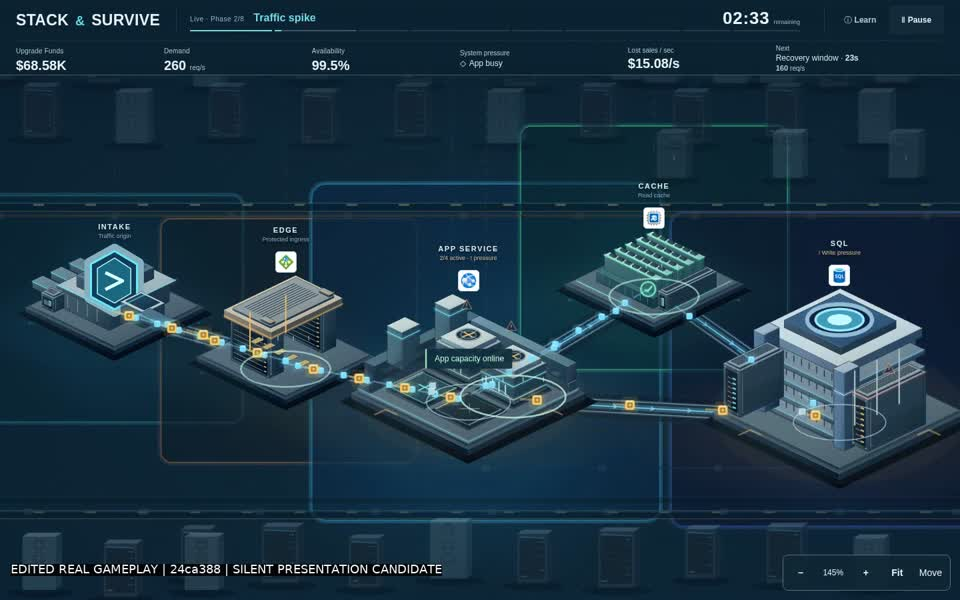
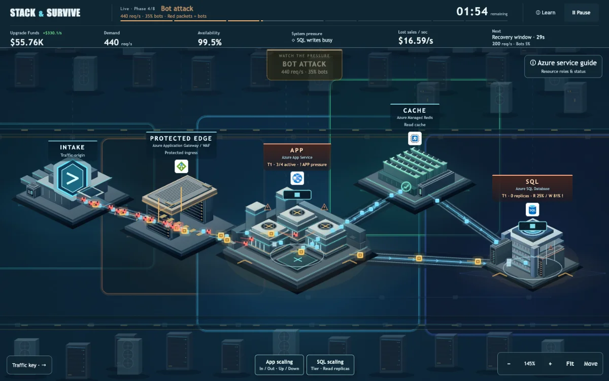
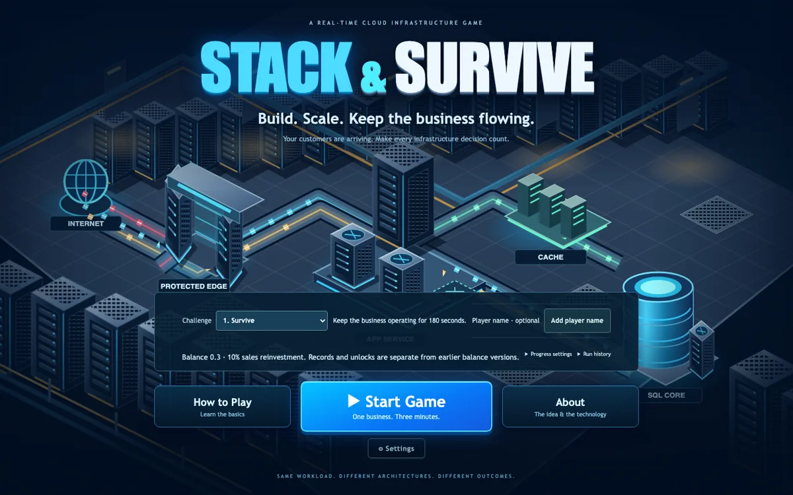
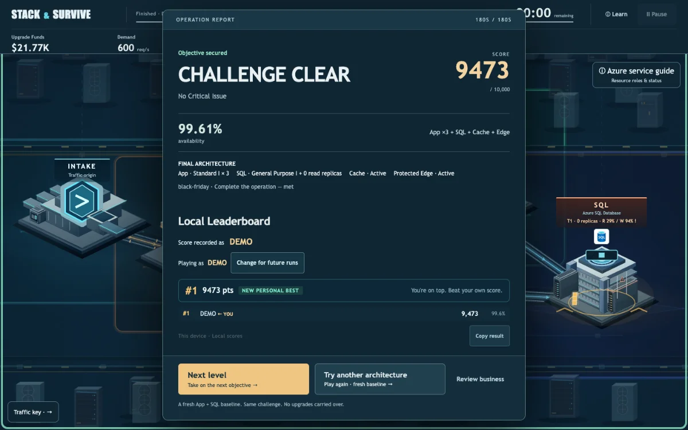
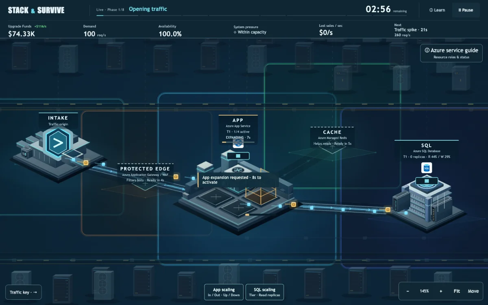
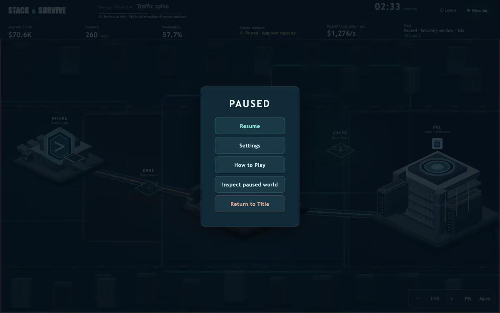

# Stack & Survive

### Build. Scale. Keep the business flowing.

A real-time cloud infrastructure strategy game: survive a 180-second traffic surge by expanding App capacity, caching reads and filtering malicious traffic.

**Same workload. Different architectures. Different outcomes.**

[**Play the game →**](https://yeongseon.github.io/stack-and-survive/) · [Illustrated guide](docs/PLAYER_GUIDE.md) · [Run locally](#run-locally) · [Development](docs/DEVELOPMENT.md) · [Contributing](CONTRIBUTING.md)

**Implementation status:** [Current release, draft features and remaining issues](docs/CURRENT_STATUS.md). The verified deployed game is `c68ec0c` / rules 0.4. Export to Azure and curated Microsoft Learn result links are implemented only in **unmerged draft PR #316**, not available in the public game. Current global API compatibility is blocked in #306; local play works independently.

## Watch the two-minute demo

[](https://raw.githubusercontent.com/yeongseon/stack-and-survive/main/docs/media/stack-and-survive-demo.mp4)

**[Watch / download the demo (MP4, 2:00, 5.9 MiB)](https://raw.githubusercontent.com/yeongseon/stack-and-survive/main/docs/media/stack-and-survive-demo.mp4)** · [Transcript, chapter guide and recording details](docs/DEMO_VIDEO.md)

Real gameplay from released build `24ca388`, edited from **two separate runs**: normal traffic → overload and service risk → actual failure → retry → infrastructure expansion → successful completion → Player Name and API-failure local fallback. **Silent video** for presenter narration, with labeled title/fallback screenshots. Global rows are existing verified scores, not these runs publicly submitted. A complete operation lasts 180 seconds; this is not a continuous two-minute run.

The official game URL is the GitHub Pages link above. No custom domain is required.

**Presenting the project?** [Open the showcase](showcase/README.md) for a 7-slide English browser deck, English speaker notes and a [downloadable PDF](showcase/stack-and-survive-showcase.pdf).



## Why play?

More servers are not always the best answer. App expansion takes time; Cache helps eligible reads but not SQL writes; Protected Edge filters bots but can reject legitimate customers. Your choices change availability, operating costs and the final score.

**See one decision change the outcome:** [53-second current-feature demo and narration](docs/DEMO_VIDEO.md#current-rules-04-the-bottleneck-tradeoff) — App expansion leaves a SQL bottleneck; a delayed SQL tier change restores service at a higher running cost. Continuous automated local gameplay, not a human learning study.

**Current rules 0.4:** App scale-in/out and tier changes, SQL tiers and read replicas are now available through facility inspection. [Scaling guide and actual captured examples](docs/INFRASTRUCTURE_SCALING.md). The video and overview screenshots below document the earlier `24ca388` / rules 0.3 release, not the current interface. See the [dated presentation handoff](docs/submission/HACKATHON_HANDOFF.md) for current verification and release blockers.

- **One living data center:** click facilities and empty bays directly; routes are automatic.
- **Eight traffic phases:** anticipate spikes, bot attacks, recovery windows and the final wave.
- **Three objectives:** finish the operation, then reach 99% and 99.9% availability on the same workload.
- **Clear consequences:** watch pressure, lost sales and Upgrade Funds; inspect the result to plan another strategy.
- **Play without an account:** local records work without a backend; the optional global leaderboard verifies submitted action replays.

## How to play

**[Follow the screenshot walkthrough →](docs/PLAYER_GUIDE.md)** — 16 actual screens covering the opening, construction, attacks, recovery, name entry, results and settings.

1. Open the [browser demo](https://yeongseon.github.io/stack-and-survive/). A desktop browser is recommended; phone gameplay requires landscape.
2. Optionally set **Player name**, choose an unlocked challenge and select **Start Game**. A name is never required to play.
3. Watch **Demand**, **System pressure** and **Next**. Click an empty App bay or the Cache/Edge footprint once to request construction. Capacity becomes available only after its activation delay.
4. Use **Learn** for capacity and routing explanations. **Pause** or **Escape** opens the game menu; **Inspect paused world** keeps time stopped. **Resume** restarts it explicitly.
   Use bottom **App scaling / SQL scaling** for instance, tier and read-replica controls; the upper-right **Azure service guide** explains all represented roles and opens inspection. SQL starts compact and grows only after tier activation. Scale-in/down reduces future capacity/cost; it does not refund past expense.
5. Inspect the score and **Details**. A qualifying result shows **Player name → Join Leaderboard** when no valid name is saved. A saved name may submit the next qualifying run automatically; it is shown beside the result. Name changes do not rename old entries.
6. Try another architecture or advance to the next unlocked objective. Each attempt starts with fresh infrastructure; history and unlocked challenges remain on this device.

### What does the money mean?

Dollar amounts are **simulated business value, not actual Azure prices**. One internal credit is displayed as **$1K**: starting funds are **$75K**, and a loss of 0.25 credit/second is **$250/s**. Only **10% of successful customer sales** returns to Upgrade Funds; bots earn nothing.

At the base tier, each App instance costs **$5K/min**; Cache and Edge cost **$8K/min** and **$3K/min**, respectively—not one-time purchase prices. Higher App/SQL tiers and SQL read replicas have separate [running costs and activation delays](docs/INFRASTRUCTURE_SCALING.md#mechanics). The emergency filtering boost costs **$8K** once. Display formatting does not change simulation values or scoring.

## Screenshots

| Start a fresh operation | Review the outcome and your score |
|---|---|
|  |  |

These are real automated captures from a clean production build of **`24ca388`**, not mockups. The result is a **local** score, and `DEMO` is an automation label—not a participant. Images are resized for this README. [Capture provenance](docs/images/README.md) · [Create your own screenshots](docs/DEVELOPMENT.md#screenshots-and-demo-evidence).

| Build before demand rises | Pause without losing your place |
|---|---|
|  |  |

## Run locally

Use **Node.js 22** (`>=22.12.0 <23`; reference version 22.22.0) and **pnpm 10.32.1**. No Azure account or API is needed for local gameplay.

```bash
git clone https://github.com/yeongseon/stack-and-survive.git
cd stack-and-survive
pnpm install --frozen-lockfile
pnpm build
pnpm --filter @stack-and-survive/web exec vite preview --host 127.0.0.1
```

Open the **root URL `/` printed by Vite** and choose **Start Game**. This ordinary production build does **not** need `?tycoon`.

For hot-reload development, run `pnpm dev` and append **`/?tycoon`** to the printed origin. The development root opens the QA/editor, not ordinary play. Production builds never enable the QA inspector through URL parameters. See [development modes and tests](docs/DEVELOPMENT.md).

## Built with

```text
React controls / results  →  shared deterministic simulation  →  Phaser world
                                      ↑
                         optional API replays actions
```

| Area | Technology / responsibility |
|---|---|
| Player UI | React, TypeScript, Vite; keyboard-accessible controls and results |
| Game world | Phaser 3; fixed isometric facilities and state-driven feedback |
| Rules | Shared headless simulation and versioned challenge definitions |
| Verification | Vitest, Playwright, asset integrity and replay regression tests |
| Hosting | Static GitHub Pages frontend; optional Azure App Service API (leaderboard + AI export proxy) |

Gameplay **does not provision cloud resources**. Azure badges identify represented service roles; capacities, timing and economics are game assumptions. The optional API is real application infrastructure, not infrastructure created by the player. Local scores and nicknames are not authenticated identities; server replay verification is not a complete anti-cheat system.

**Export to Azure** turns the final architecture of a finished run into Bicep and a per-resource rationale using Azure OpenAI via the optional API. The export is text only; it never deploys, and it never changes simulation, scoring or replay. It is available only for rules 0.4 with an API configured; generation remains unavailable until the API's server-only Azure OpenAI settings are supplied. Generated scaffolds need human review, real identity parameters, application integration and local compilation before any independently authorized deployment.

**Validation status (#315):** implementation is tested with mocked AI responses and a hand-authored compiled fixture. Actual Azure OpenAI credentials were unavailable during implementation, so a real played-run → model generation → Bicep compilation smoke is still required. No live export service or Azure configuration change is claimed.

The result also links to **Microsoft Learn** for each service present in your final architecture and for Bicep. These fixed official links work without an API or AI configuration; the model cannot choose their destinations.

## Develop and contribute

Start with [CONTRIBUTING.md](CONTRIBUTING.md) for issue selection, small PRs, verification and rights boundaries. The [development guide](docs/DEVELOPMENT.md) covers workspace structure, player/QA modes, API configuration, tests and screenshot generation.

```bash
pnpm lint
pnpm typecheck
pnpm test
pnpm build
```

These are the fast baseline checks, not a substitute for relevant browser tests. Keep changes focused: UI, world rendering, simulation and backend work have different owners and acceptance criteria.

## Documentation

- [Documentation index](docs/README.md) — authoritative contracts and reading order.
- [Gameplay](docs/GAMEPLAY_SPEC.md) · [Simulation rules](docs/SIMULATION_SPEC.md) · [Technical design](docs/TECHNICAL_DESIGN.md).
- [Leaderboard architecture](docs/LEADERBOARD_ARCHITECTURE.md) · [API contract](docs/LEADERBOARD_API_CONTRACT.md) · [Backend evidence](docs/BACKEND_PRODUCTION_EVIDENCE.md).
- [Demo and submission pack](docs/submission/README.md) — script, fallback, screenshots and participant worksheet.
- [Current work and remaining acceptance](https://github.com/yeongseon/stack-and-survive/issues/7).

## Project status and rights

The game, final command HUD, simulated-dollar display and player-name UX are implemented. The `github.io` demo no longer redirects to the former account domain. Check the [latest workflows](https://github.com/yeongseon/stack-and-survive/actions) for the exact deployed revision; a merge or successful skipped workflow is not deployment evidence. Actual participant, listening/device and rights decisions remain separately tracked in #25, #195, #159, #149 and #164.

**Public source is not the same as licensed open source.** No project-wide code or original-art license has been selected. The existing demo is owner-authorized under a narrow [exact-inventory exception](docs/PAGES_DEMO_EXCEPTION.md), not general redistribution clearance. Microsoft Azure assets remain separately attributed under their own terms; no Microsoft endorsement is implied. Read the [licensing status](docs/LICENSING_STATUS.md) and [asset attribution](apps/web/public/assets/ATTRIBUTION.md) before reusing or contributing assets.
