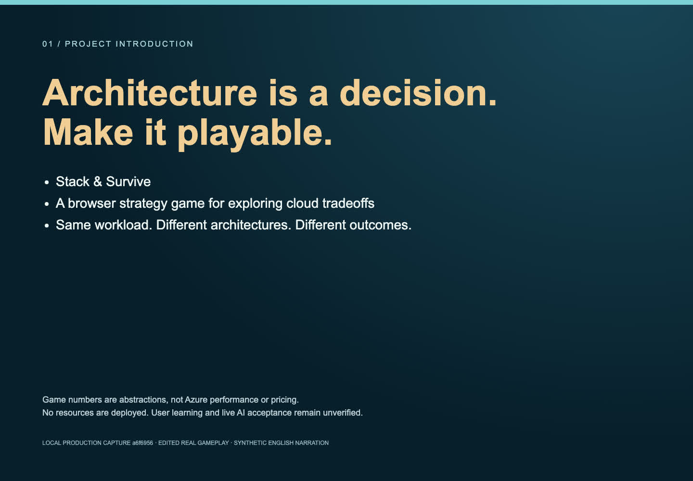
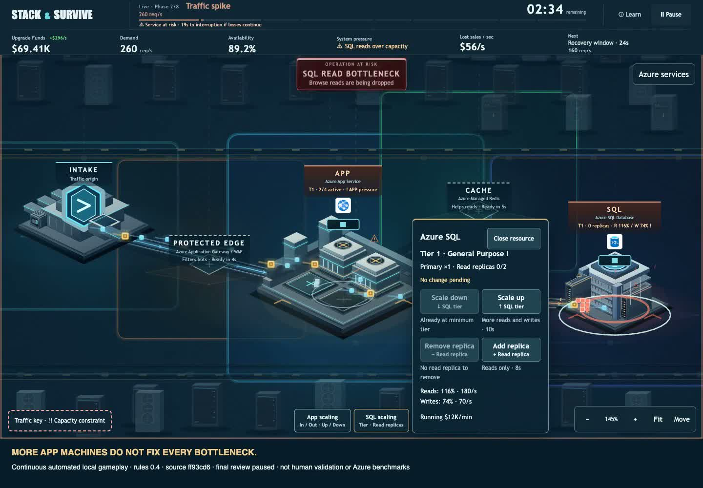

# Stack & Survive — demo video

## Two-minute project introduction — current source

[](https://raw.githubusercontent.com/yeongseon/stack-and-survive/main/docs/media/project-introduction-120s.mp4)

**[Watch/download the new project introduction (MP4, exactly 2:00)](https://raw.githubusercontent.com/yeongseon/stack-and-survive/main/docs/media/project-introduction-120s.mp4)** · [English transcript](media/PROJECT_INTRO_NARRATION.md) · [English SRT](media/project-introduction-120s.srt) · [Edit/provenance manifest](media/project-introduction-120s.json)

This is not gameplay-only: **24s project/problem introduction → 66s edited real gameplay/result → 20s implemented agent design → 10s closing**. Source `a6f6956` includes the merged Export/Agent and Learn code. Captured from a local production build with API empty, not a hosted or live-model run. The runtime was clean; capture tooling was uncommitted and is disclosed in the manifests. The 180-second operation really completed at 9,473 points / 99.61% availability; edits are labeled and playback is not accelerated. No external score was submitted.

| Time | Content |
|---|---|
| 0:00–0:12 | Why a playable architecture experience: components versus decisions |
| 0:12–0:24 | Project introduction: 180 seconds, eight phases, availability/cost tradeoffs |
| 0:24–0:44 | Actual App construction and Cache activation |
| 0:44–1:02 | Later real bot attack; protection and bottlenecks |
| 1:02–1:16 | Later real final wave; 600 req/s |
| 1:16–1:30 | Actual completed result and local score |
| 1:30–1:50 | Agent architecture explanation **not a live AI demo**; activation verification pending |
| 1:50–2:00 | Technology, learning links and game URL |

Audio: **offline macOS Samantha synthetic English narration at 175 words/minute**, normalized to a target −18 LUFS / −2 dBTP; no music, game audio muted. Each original voice segment fits its chapter without truncation. Full English captions are supplied as SRT and embedded selectable subtitle track; chapter captions are burned in. Sentence subtitle timing is word-weighted, not forced-aligned. Automated decode/level/playback checks are not a human listening or pronunciation review. The owner must check voice/asset use and event rules before submission; no new license clearance is implied.

The video has 3,000 video frames at 25fps, 1440×1000, H.264/AAC, and a 120.000s container/video/audio duration. Exact bytes and SHA256 are recorded in the manifest. Prior media below is retained, not silently overwritten.

### Automatic regeneration

```bash
pnpm install --frozen-lockfile
node scripts/capture-current-media.mjs
node scripts/render-project-video.mjs test-results-submission/current-<timestamp> --voice
node scripts/check-project-media.mjs
node showcase/check.mjs
node showcase/export-pdf.mjs
```

Capture rebuilds production with the optional API disabled, records ordinary inputs, blocks external requests and stores frame observations/build hashes. The renderer creates intro/outro cards, chapter captions, eight narrated segments and 19 refreshed WebP images. `--voice` requires installed macOS `say`/Samantha; omit it for a silent edit with transcript and SRT. FFmpeg/ffprobe and installed Playwright Chromium are required; no paid/network voice or new runtime dependency. Raw footage remains ignored locally; committed outputs are in `docs/images/` and `docs/media/`.

Each render uses a fresh temporary output folder within the capture directory, avoiding stale intermediate clips. The manifest records Node/Chromium/FFmpeg/OS/voice details. This is a repeatable workflow, not a guarantee of byte-identical codecs/voice across toolchain versions. Checks compare committed artifacts to their reviewed manifest; hashes are not signed provenance or protection against someone altering both. Subtitle alignment is approximate, so review the supplied SRT and narration before submission.

[Current status](CURRENT_STATUS.md) distinguishes confirmed hosted releases, local recording sources and merged-but-unactivated AI code. Older videos below retain their original `ff93cd6` and `24ca388` local recordings; neither was overwritten by the new introduction.

[Back to README](../README.md) · [Play the game](https://yeongseon.github.io/stack-and-survive/)

## Current rules 0.4: the bottleneck tradeoff

[](https://raw.githubusercontent.com/yeongseon/stack-and-survive/main/docs/media/scaling-tradeoff.mp4)

**[Watch the 53.4-second current-feature clip](https://raw.githubusercontent.com/yeongseon/stack-and-survive/main/docs/media/scaling-tradeoff.mp4)** · [machine-readable provenance](media/scaling-tradeoff.json)

One continuous, unaccelerated local production recording from runtime source `ff93cd6` (released `4c3e1e7` plus the inspector-boundary fix). Automated ordinary-player controls; no state injection, player name or public score submission. Silent H.264, 1440×1000, 25fps, 53.4 seconds; full-file decode verified. The 1440×900 game is preserved above a provenance footer. Final inspection is **paused**, not a completed 180-second run. This recording proves the observed game behavior, not human learning, real Azure performance or deployment status.

| Approximate clip time | Actual observation | Suggested spoken English |
|---|---|---|
| 0–9s | Title, countdown, compact Tier 1 SQL | “Infrastructure decisions are easier to understand when you can see their consequences.” |
| 9–18s | App scale-out request and real activation delay | “I add another App machine. More capacity arrives after construction, not immediately.” |
| 18–34s | SQL inspection; demand rises to 260 req/s | “The App now has enough capacity, but SQL reads are at 116%. Availability falls to 89.2%, losing 56 simulated dollars per second.” |
| 34–47s | SQL tier upgrade requested; old capacity remains during the delay | “More App machines won't fix this database bottleneck. I scale up SQL and wait for the change to take effect.” |
| 47–53.4s | Same 260 req/s, SQL reads 69%, availability 100%, losses zero; final inspection paused | “The same workload now recovers. But SQL running cost rises from 12 to 22 thousand simulated dollars per minute. The game is about the right tradeoff—not building everything.” |

The suggested narration is a descriptive transcript, not a timed human read-aloud. Shorten it for a live delivery. These are current tick values, not full-run averages. Cache or a read replica can be other choices for a read bottleneck; this clip does not establish SQL tier-up as optimal. Counts, prices and delays are game abstractions, not Azure pricing or benchmarks.

- MP4 SHA256: `20ea612ee3a540a086a07f8a470a78d1a6ae851f662d6c0c65974682bf043dfd`.
- Captured 2026-09-20 UTC; workspace contained uncommitted capture/docs work, disclosed as `dirtyTree: true`. Runtime source was committed; JS/CSS hashes and raw observations are in the manifest. Raw files remain under ignored `test-results-submission/`.
- Reproduce: `pnpm build`, then `node scripts/capture-tradeoff.mjs`. Requires FFmpeg/ffprobe and installed Chromium. Inspect frames, then run `node scripts/publish-tradeoff.mjs <successful capture directory>`. Publishing here means copying verified files into the repository, not deploying or submitting to an event.
- Current global API compatibility remains blocked in #306. This clip makes no leaderboard-success claim.

## Historical two-minute overview — rules 0.3

[](https://raw.githubusercontent.com/yeongseon/stack-and-survive/main/docs/media/stack-and-survive-demo.mp4)

**[Watch / download MP4](https://raw.githubusercontent.com/yeongseon/stack-and-survive/main/docs/media/stack-and-survive-demo.mp4)** · [Repository file](media/stack-and-survive-demo.mp4)

GitHub Markdown does not reliably provide an inline player for a committed MP4. Click the preview or video link to open the file; if the browser downloads it, play it locally. The video is not loaded by the game, so it does not increase gameplay asset downloads.

## What the video shows

**Historical demonstration:** this video records `24ca388` / rules 0.3. The current game adds rules 0.4 infrastructure scaling and newer onboarding; this recording does not verify those features or the current backend. See the [current handoff](submission/HACKATHON_HANDOFF.md) and [scaling captures](INFRASTRUCTURE_SCALING.md#captured-scenes).

This is a **120-second, silent, edited demonstration of two actual ordinary-player runs**, including both success and failure. Run A deliberately makes no upgrades, reaches service interruption, and restarts. Run B is a separate recording with App, Cache and Edge construction and a real completed result. The transition between recordings is labeled; it is not presented as one continuous attempt. Moving clips remain at original speed. The title (8 seconds) and local-fallback ending (12 seconds) are labeled actual screenshots from Run B. All footage uses the same public Pages build, not an editor or mockup.

| Time | Picture | Suggested English narration / descriptive transcript |
|---|---|---|
| 0:00–0:08 | Actual title screenshot | “Same workload. Different architectures. Different outcomes.” |
| 0:08–0:23 | Run A: normal traffic, no upgrades | “One App instance handles the opening traffic. The money represents simulated business value, not real Azure prices.” |
| 0:23–0:33 | Run A: overload and service risk | “Demand rises, availability falls, and sales are lost. If this continues, the service will stop.” |
| 0:33–0:43 | Run A: actual failure, score 810 | “Without upgrades, this run failed at 45 seconds. The result explains what went wrong.” |
| 0:43–0:51 | Run A: Play again and fresh start | “After failure, start again with fresh infrastructure.” |
| 0:51–1:10 | Run B: separately recorded construction | “This is a different, separately recorded run. We prepare App, Cache and Edge ahead of demand, then wait for construction to complete. Capacity is not instant.” |
| 1:10–1:30 | Run B: customer spike and bot attack | “Cache helps eligible reads. Edge filters bots but can also reject legitimate traffic. We have to balance processing capacity, running costs and customer losses rather than simply building more.” |
| 1:30–1:40 | Run B: real completion, score 9454 | “This run completed all 180 seconds. Review availability, costs and the final score.” |
| 1:40–1:48 | Player Name and existing global rows | “These global rows are earlier verified runs, not a submission of this recorded run.” |
| 1:48–2:00 | Actual local-fallback screenshot after browser API block | “Here the browser API requests were blocked deliberately. The local score remains, while pending verification and retry are shown separately.” |

The transcript is suggested narration, **not an audio track**. On-screen labels identify edited gameplay, the title still and the existing-global-score limitation. Narration and any actual listening/haptic acceptance remain separate.

## Recording identity and verification

| Property | Value |
|---|---|
| Released source / Pages SHA | `24ca38805015cf87de710cb2ce9ffa5904ffc14f` |
| Run A capture started | 2026-09-18T00:16:41.977Z |
| Run B capture started | 2026-09-17T19:48:52.611Z |
| Public game | https://yeongseon.github.io/stack-and-survive/ |
| Browser | Chromium153.0.8010.12, automated ordinary-player inputs |
| Source recordings | Run A: real failure at game time45s and retry; Run B:239.48seconds including real180second completion and result interaction |
| MP4 | H.264,1440×900,25fps,120.000seconds; no audio stream |
| File size | 6,160,277 bytes (about 5.9 MiB) |
| MP4 SHA256 | `0ba01d4aa201919ee2fa11f62e338c9d30ce25902ad373bf31a3400c1a5815a2` |
| Run A raw SHA256 | `dbcb82b3ea769d6d77e253da55b12719c96bda76024957e38a27d5fc7f70e213` |
| Run B raw SHA256 | `dbfa723433fb08c25ea59309fd144795f871f0fad4e2814d49b623e440a79d3f` |
| Title still SHA256 | `38ac281c29c81202622e2573ea7f2597e1331ac0f25e59b4bbbee1ee7bff937b` |

The MP4 is encoded with `faststart` for browser delivery. Full-file FFmpeg decode and ffprobe duration/codec checks succeeded. This verifies decoding, not human acceptance or all-device playback. The preview is extracted from the video at 78 seconds.

### Edit provenance

Output uses: title still 8s; Run A video12–27s,36–46s,54–64s,64–72s; Run B video20–39s,42–52s,106–116s,216–226s,226–234s; Run B local-fallback screenshot held12s. Both manifests have the same captured HTML hash `318700c1d44d0a13c7da4ead0fee7fb8a9f215e9b05c4c92008404c7baa75b37`. The server board changed between recordings; rows are observed at their respective capture times, not a fixed shared score fixture. Raw recordings and manifests are retained in PC3 evidence, not loaded by the game.

## Demonstration boundaries

- No injected score, accelerated simulation or invented participant. Automation drove real player controls.
- Existing server rows were read successfully. Before saving YS, the capture runner deliberately aborted API requests in its browser context to demonstrate local fallback. That is not evidence of a successful public submission for this run.
- The visible results and server board are different: Run A failed with810; Run B completed with9454. The displayed global entries belong to previously verified server runs. Neither run was publicly submitted by this capture.
- This video does not establish unfamiliar-player comprehension, voluntary replay, listening, physical vibration or rights clearance.
- Recording a released demo does not grant broader reuse rights. See [licensing status](LICENSING_STATUS.md), [asset attribution](../apps/web/public/assets/ATTRIBUTION.md) and the [demo exception](PAGES_DEMO_EXCEPTION.md).

For presentation fallback, download the MP4 before the event. For a live demonstration, use the game link. See the [demo fallback guide](submission/DEMO_FALLBACK.md) and [submission checklist](submission/README.md).
