# Illustrated player guide

[Play now](https://yeongseon.github.io/stack-and-survive/) · [README](../README.md) · [Development guide](DEVELOPMENT.md)

Follow one operation from title to result. Screenshots are refreshed actual automated local captures from **`a6f6956`**, rules 0.4, resized without changing UI values. They illustrate behavior—not a guarantee that approximate timing produces the same score. The final overload is a **separate** run. [Full provenance](images/README.md).

Use bottom **App scaling / SQL scaling** for instance/tier/replica controls; upper-right **Azure service guide** explains all roles. SQL starts compact and grows after an activated tier change. [New two-minute introduction](DEMO_VIDEO.md#two-minute-project-introduction--current-source) includes the project explanation. Export/Agent code and Learn links are merged; live AI activation remains unverified (#325), so the capture shows no generated response.

## 1. Start without an account

Choose an unlocked **Challenge**, optionally set **Player name**, then press **Start Game**. First-time players begin with the survival objective; later objectives require higher availability on the same workload. A name is only necessary when joining the leaderboard.

The camera introduces the hall before the countdown. There is no architecture editor to configure before ordinary play. Your initial infrastructure is Internet intake, one App instance and SQL.

## 2. Read the command HUD

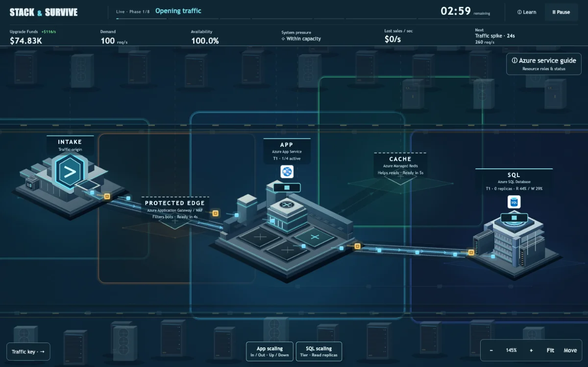

| Reading | How to use it |
|---|---|
| Phase / remaining time | Track where you are in the 180-second operation. |
| Upgrade Funds | Funds available for the run; 10% of successful customer sales is reinvested. |
| Demand | Incoming requests per second, including bots when present. |
| Availability | Whether legitimate customer requests are being served. |
| System pressure | A concise indication of the resource under pressure. |
| Lost sales | Simulated value lost from unserved legitimate customers per second; excludes bots. |
| Next | Incoming phase, countdown and demand. Prepare before it arrives. |

**Money is simulated business value.** `$75K` represents 75 internal credits, not an Azure bill. `$250/s` represents 0.25 credit per second. Do not confuse the score with revenue or funds.

## 3. Expand before capacity is needed

Click an **empty App bay once**, or **App scaling → Scale out**, to request expansion. A construction bay is not active capacity. Expansion takes **8 seconds**, adds the current tier's per-instance running cost (**$5K/min at Tier 1**) and stops at four. **Scale in** removes one instance after 3 seconds, minimum one; **Scale up/down** changes all App instances' tier after 6 seconds. No refund or permanent bonus is created.

A repeated or unavailable request does not create free extra capacity. Resource controls explain why an action is unavailable. Select an installed facility for its local actions; **Learn** explains the underlying roles.

## 4. Cache reads—not SQL writes

Click the empty **Cache** footprint to request deployment. It takes **5 seconds**; active Cache costs **$8K/min**. It helps eligible reads, while Order writes still need SQL. It cannot fix every bottleneck.

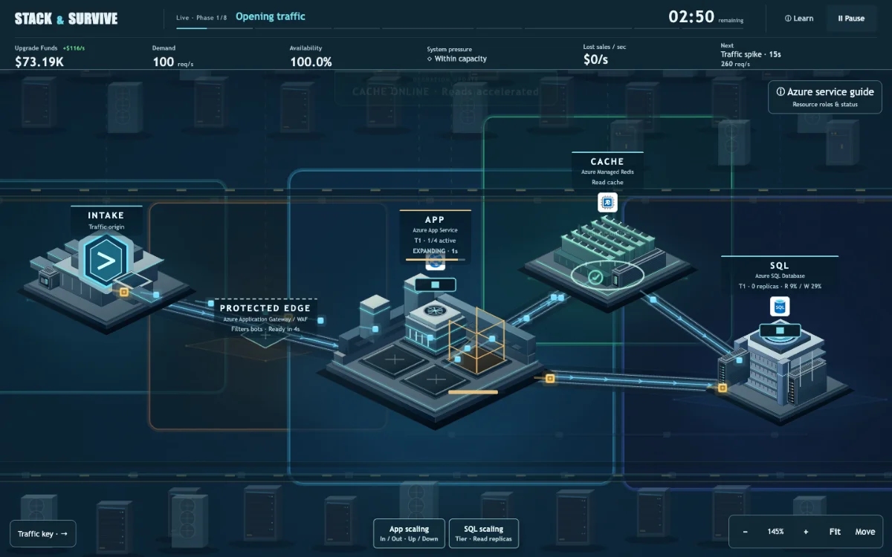

More App capacity can move pressure downstream to SQL. Avoid treating every failure as an instruction to add another App.

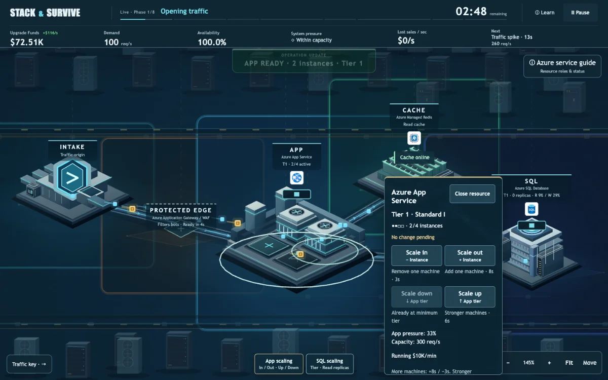

Use **SQL scaling → Scale up/down** to change read/write capacity after 10 seconds. **Add/remove replica** changes read capacity only (8s add, 3s remove; maximum two). Tier and replica running costs are in the [scaling table](INFRASTRUCTURE_SCALING.md#mechanics). Existing capacity/cost remains until activation; the card shows queued/pending time and why an action is disabled. Cache and replicas do not solve write pressure.

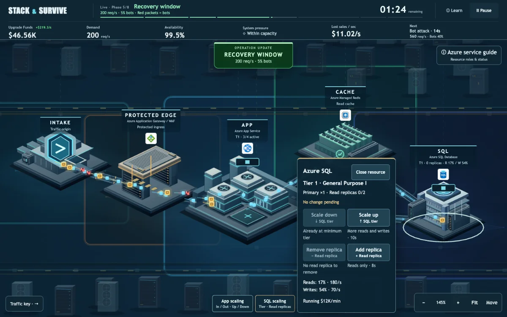

## 5. Watch the warning, then the consequence

| Before the spike | When the spike arrives |
|---|---|
| 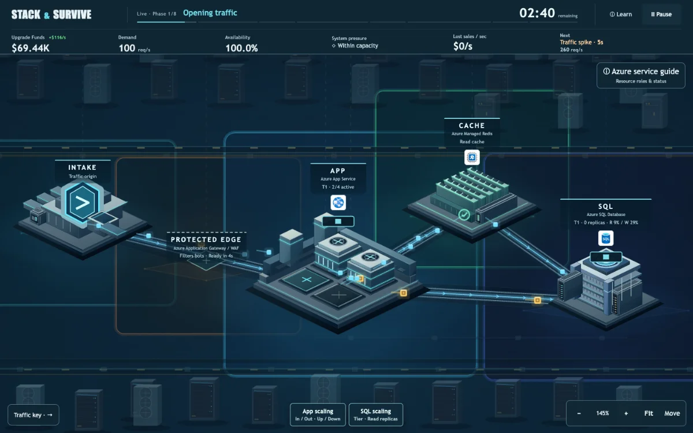 | 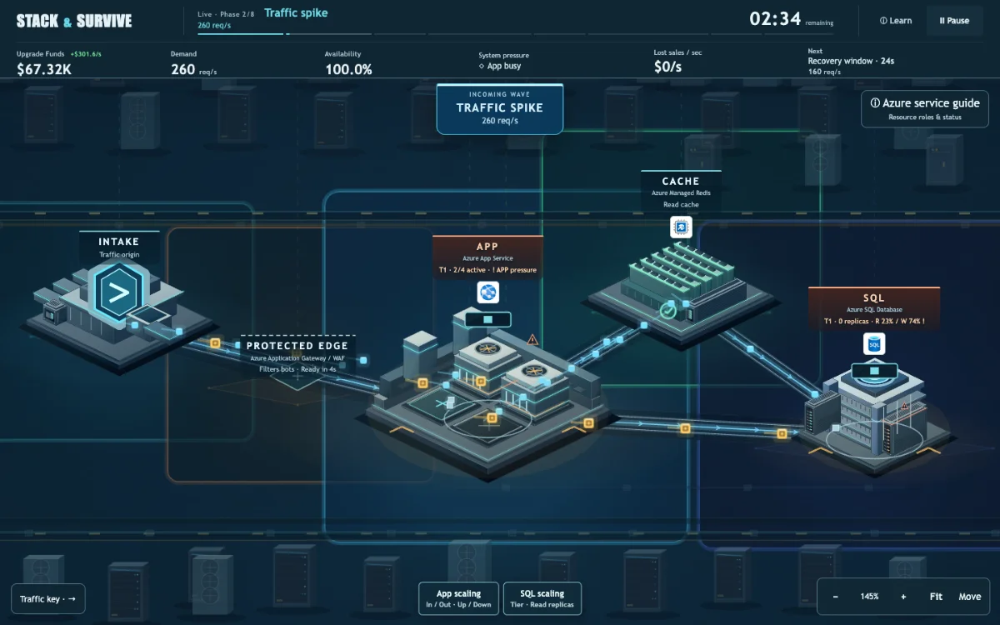 |

The next-event warning is not extra demand yet. Construction continues according to actual game ticks, so a last-second request may arrive too late. The availability and lost-sales readings describe what happened, not an invented reward animation.

## 6. Protect the edge during bot attacks

**Protected Edge** takes **4 seconds** to deploy and costs **$3K/min** while active. It filters malicious traffic but can also reject legitimate customers. The optional one-use filtering boost costs **$8K** and lasts **30 seconds**; inspect the installed Edge to use it.

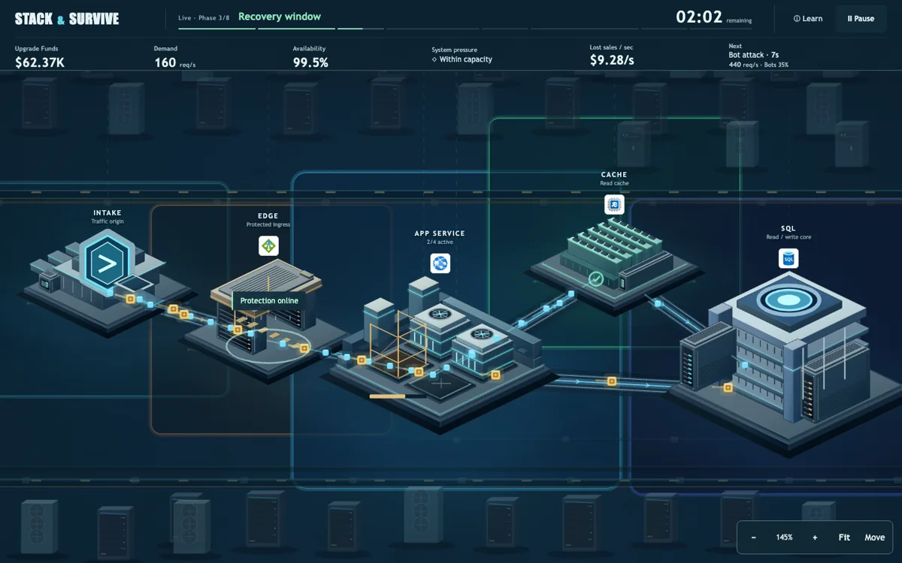

Bots generate no funds. Highest availability and highest total score need not come from the same architecture; the result explains the tradeoff rather than promising that every upgrade is beneficial.

## 7. Use recovery windows to plan

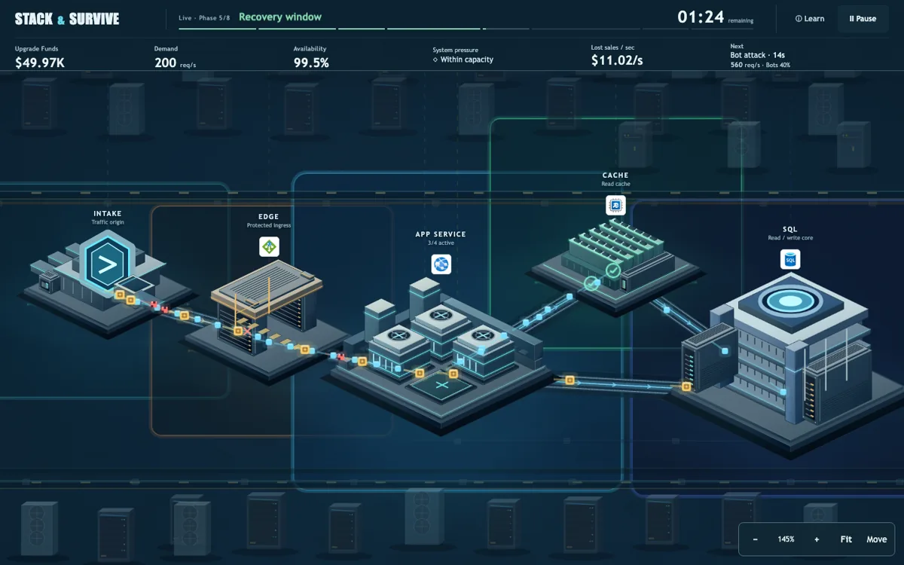

Lower pressure gives you time to inspect what changed and prepare for later demand. Do not mistake it for completion: the final wave is still ahead.

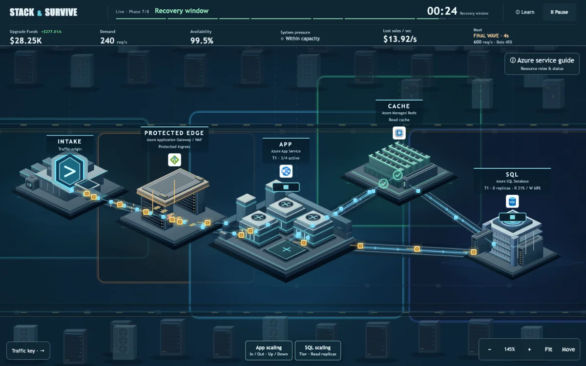

Camera controls—zoom, drag/pan and **Fit**—change your view, not your capacity, funds or score. There is no speed-up button or queue that stores dropped requests for later service.

## 8. Read the result and join under your name

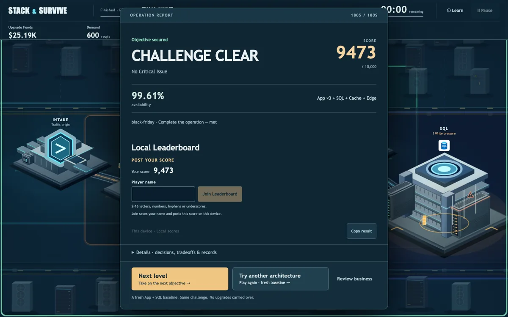

The result appears without waiting for a server. If you met the objective and have no saved name, enter **2–16 letters, numbers, hyphens or underscores**, then choose **Join Leaderboard**. Validation errors stay beside the input. The game never invents an Anonymous name for you.

- A saved name can be used automatically for a future qualifying result; the submitted identity is displayed explicitly.
- **Change for future runs** changes your saved preference, not existing entries.
- **Global Leaderboard / Verified server replay** means the optional server supplied the ranking. **Local Leaderboard / This device** is browser-local data, not trusted global competition.
- A failed or nonqualifying run can inspect the board but cannot submit a score. A new player is not asked for a name solely for failure.
- **Details** contains monetary results, decisions, comparisons and history. **Try another architecture / Play again** starts fresh infrastructure; **Next level** advances when unlocked.

The images show **local-only automation**, not a live public submission. The online list can differ.

Current operational limitation: the configured API rejects current rules 0.4 challenge reads (#306), so do not promise a global submission until backend compatibility is verified. Local results remain available.

### Continue learning

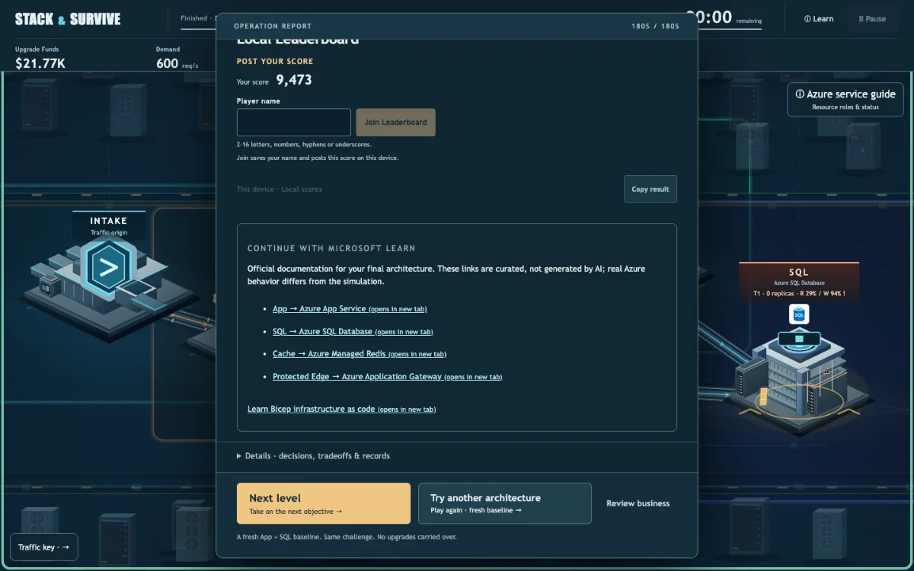

Official links follow the services in your final architecture and work without AI configuration. AI generation requires separately configured, verified server services; this capture does not simulate their success.

## 9. Use landscape and scroll results when needed

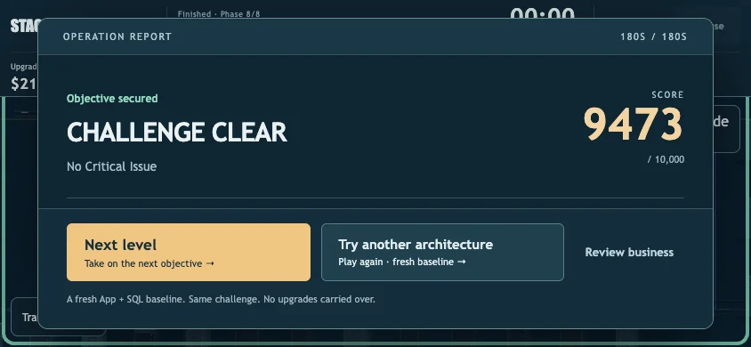

On phones, rotate to landscape for gameplay. The portrait gate does not change the map. Results on short screens are scrollable; action controls remain available. Fullscreen/orientation locking depends on browser support and is not required for manual rotation.

## 10. Diagnose pressure instead of hiding failure

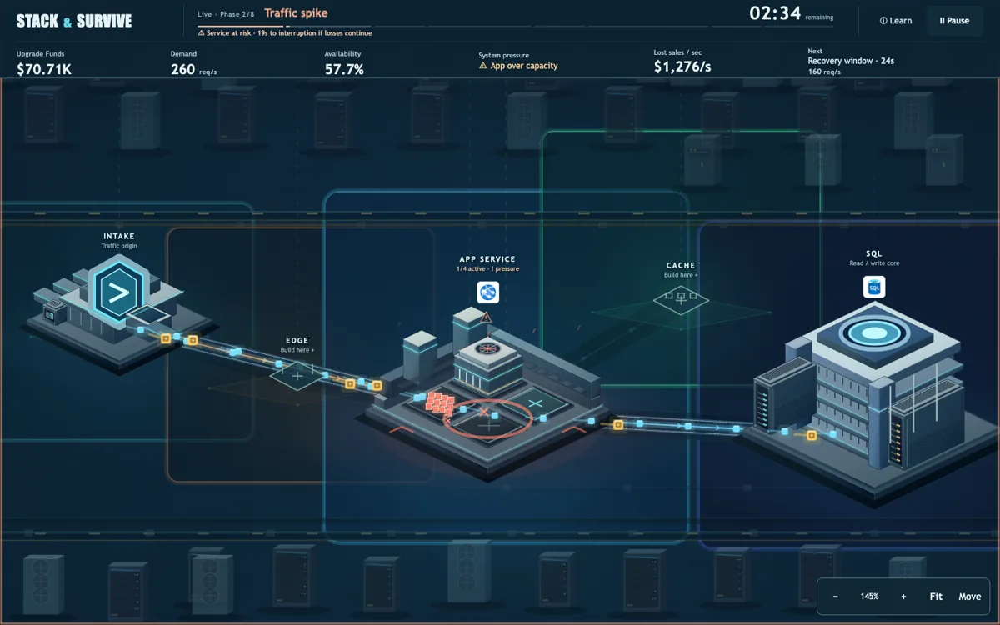

This is a **different, deliberately unprotected run**, not the successful architecture above. A service-risk countdown means interruption can happen **if losses continue**. It is an existing failure condition, not an additional penalty. Failed attempts are useful evidence for the next decision.

## 11. Pause, inspect and adjust comfort settings

| Pause menu | Settings while paused |
|---|---|
|  | 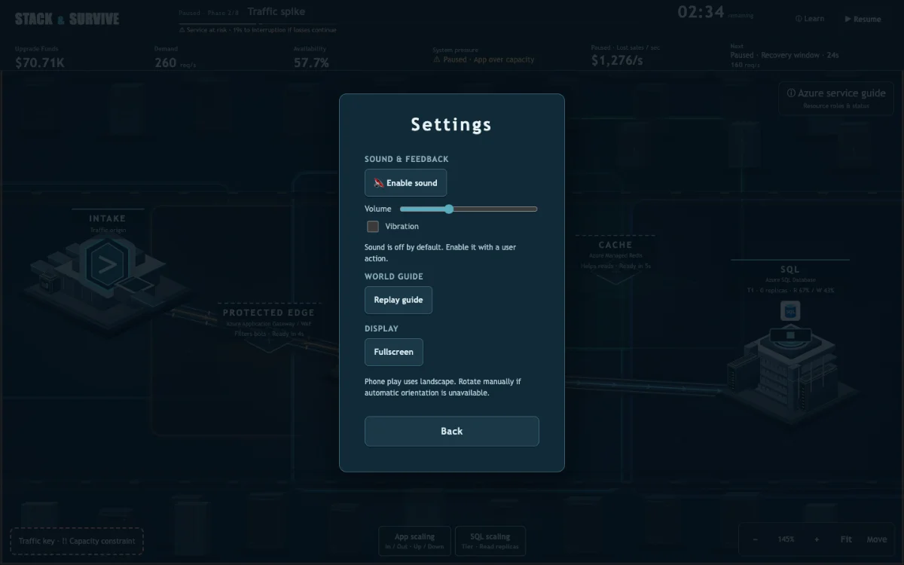 |

**Pause** or **Escape** stops time and opens the menu. **Inspect paused world** closes the menu without resuming. Help/settings preserve that pause; **Resume** explicitly restarts time. Sound is opt-in, and device vibration/fullscreen support varies.

Refreshing returns to the title rather than resuming an in-progress operation. Completed history, challenge progress and saved name are local to that browser. Private browsing starts fresh. If the API is unavailable, finish the game locally and use the visible retry/fallback explanation; do not assume a local row was verified by the server.

## Report an issue or improve the game

Include your browser, viewport, challenge, steps and whether the issue occurred in the public demo or a local build. A screenshot of the relevant HUD/result is more useful than “it broke.” Never include credentials or private data. See [Contributing](../CONTRIBUTING.md) and [screenshot reproduction](DEVELOPMENT.md#screenshots-and-demo-evidence).
